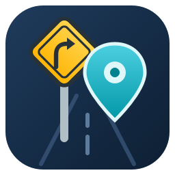
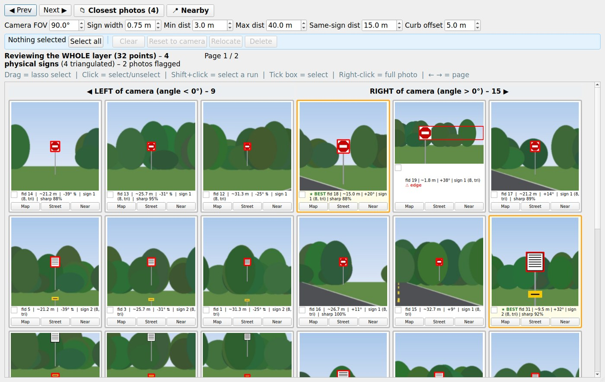
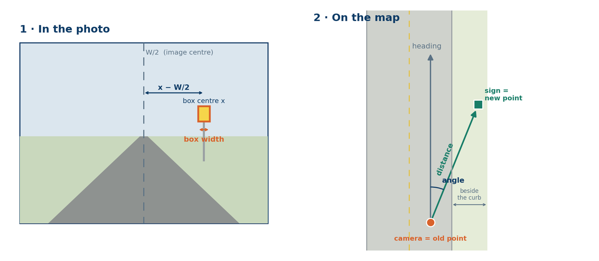
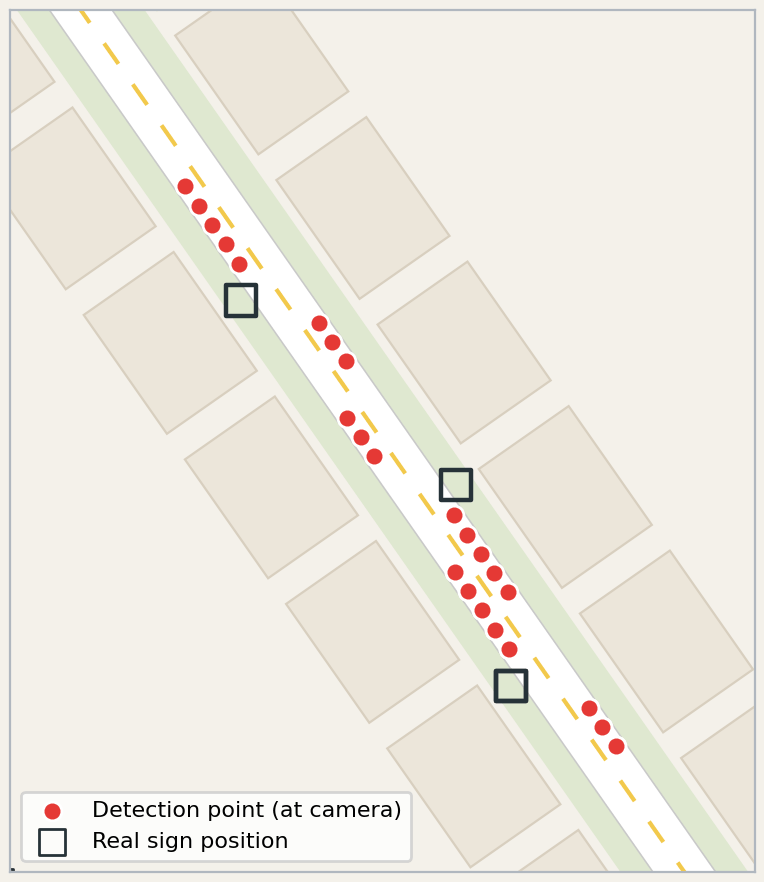
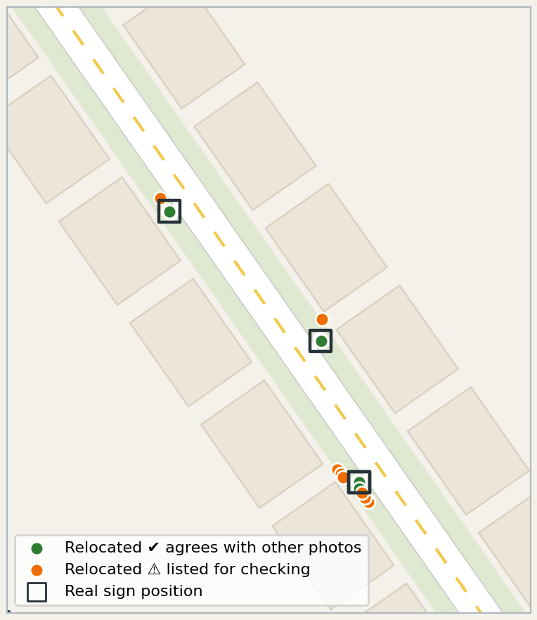
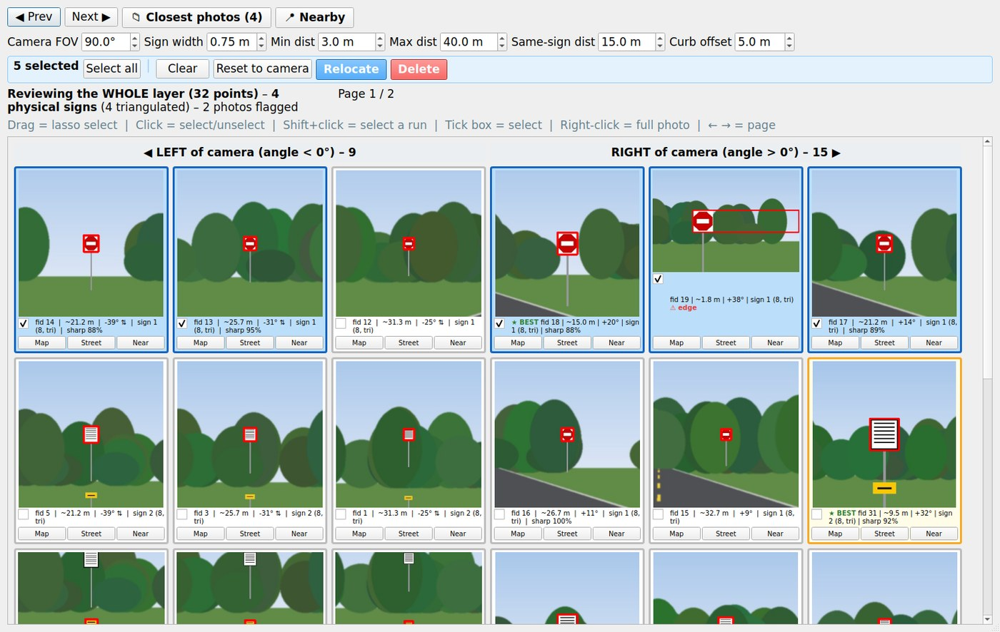
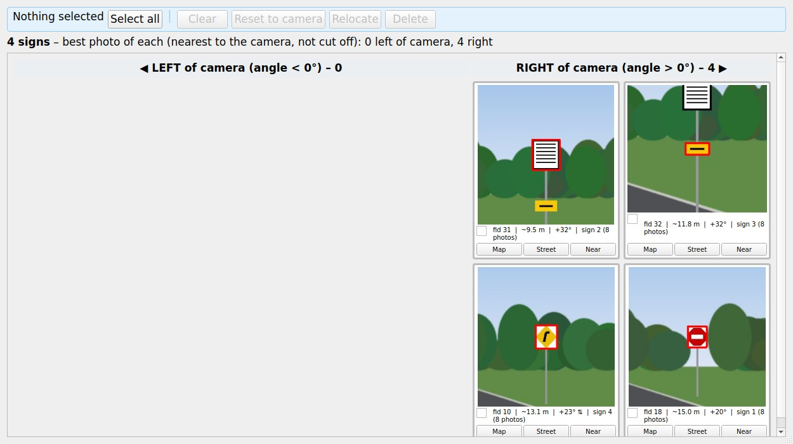
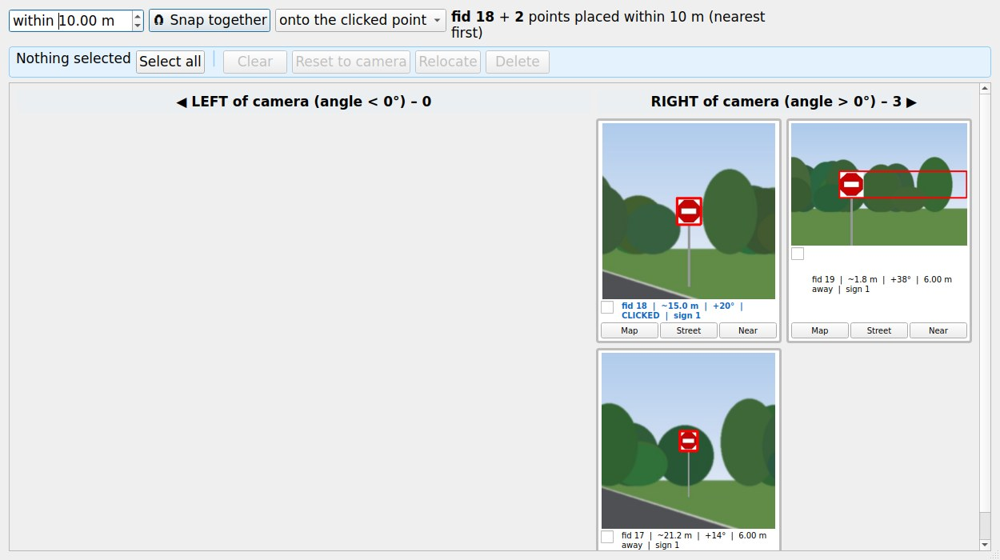
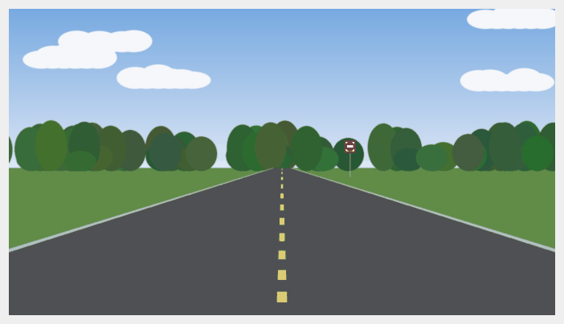

<p align="center">
  
</p>

<h1 align="center">Sign Review</h1>

<p align="center">
  <b>A QGIS plugin that turns thousands of road-sign detections into reviewed, correctly placed points – on one screen.</b>
</p>

<p align="center">
  <a href="https://github.com/saadakhs10/sign-review-qgis/releases/latest"></a>
  
  
  
  <a href="LICENSE"></a>
</p>

<p align="center">
  
</p>

--   -

## Why this plugin exists

Mobile-mapping detectors produce **many points per road sign** – one for every photo the car
takes while driving past – and every point is stored at the **camera position, on the road**,
not at the sign. Reviewing them the usual way (QGIS Map Tips: hover over a point, wait for its
photo, Identify, drag the point to a guessed spot) means handling every point one at a time,
checking the same sign again and again, and placing signs by eye. For a layer with thousands of
detections that took about **two days**.

Sign Review puts the whole cluster on one screen and does the geometry:

- **See every photo at once**, cropped to its box, sorted **Left | Right** of the camera.
- **Each sign once**: photos of the same sign are grouped and the best one is highlighted.
- **Relocate in bulk**: points move from the camera to the sign using heading, angle and box size,
  kept off the road.
- **Clean up fast**: lasso-select, Delete, Reset to camera, and Snap together duplicates.

## Features

| | Feature | What it does |
| :-: | --- | --- |
| ◧ | **Left \| Right columns** | Every photo goes left or right of the camera from its box position: `angle = atan((box centre x − W/2) / focal)` |
| ▦ | **Lasso selection** | Drag a rectangle over the photos; click, Shift+click and tick boxes also work. Selected points are highlighted on the map |
| ★ | **Best photo per sign** | Gold frame on the photo **nearest to the camera whose box is not cut off** – one per sign |
| 📁 | **Closest photos** | A folder-like window with the best photo of every sign |
| ➚ | **Relocate** | Moves each selected point from the camera to its sign: bearing = heading + angle, distance = sign width × focal / box width. Points that would land on the road are moved beside the curb |
| ↺ | **Reset to camera** | Puts points back on `original_x`, `original_y` |
| 📍 | **Nearby** | Click a point on the map (or **Near** on a tile): a popup lists every point within the distance you set (starts at 1 m) |
| 🧲 | **Snap together** | Moves the points of one sign onto one spot – the clicked point or their middle |
| 🗑 | **Delete** | Deletes the selected points in one undo step |
| 🗺 | **Map / Street / full photo** | Pan to the point, open Google Street View at the camera, right-click for the whole photo |

Everything is undoable until **Save Layer Edits**.

## How it works

<p align="center"></p>

```text
focal    = (W / 2) / tan(FOV / 2)              W   = photo width in pixels, FOV = 90° by default
angle    = atan((box centre x − W / 2) / focal) < 0 = LEFT of the camera, > 0 = RIGHT
bearing  = heading + angle
distance = sign width × focal / box width       a 0.75 m sign looks smaller farther away
sign     = camera position + distance in the bearing direction
```

*Example:* a 1466 px photo gives `focal = 733 px`; a box centred at x = 1238.5 and 49 px wide
gives an angle of **+34.6°** (right of the camera) and a distance of **≈ 11.2 m**.

- **Same sign** – every photo gives one estimated sign position; positions closer than
  *Same-sign dist* (15 m) form one sign (DBSCAN), separately per driving direction and side.
  Two boxes in one photo are always two signs.
- **Off the road** – a point closer than *Curb offset* (5 m) sideways to the driving line is
  moved out beside the curb. For overhead signs set *Curb offset* to 0.

<table>
  <tr>
    <td align="center"><br><sub>Before – every point at the camera</sub></td>
    <td align="center"><br><sub>After Relocate – each point at its sign</sub></td>
  </tr>
</table>

## Screenshots

<table>
  <tr>
    <td align="center"><br><sub>Lasso selection and the action bar</sub></td>
    <td align="center"><br><sub>📁 Closest photos – one per sign</sub></td>
  </tr>
  <tr>
    <td align="center"><br><sub>📍 Nearby and 🧲 Snap together</sub></td>
    <td align="center"><br><sub>Right-click – the full photo</sub></td>
  </tr>
</table>

<sub>Screenshots use generated sample photos, not real project data.</sub>

## Installation

### Option A – plugin repository (recommended, automatic updates)

1. QGIS → **Plugins → Manage and Install Plugins → Settings → Add…**
2. Name: `Sign Review`, URL:
   ```
   https://github.com/saadakhs10/sign-review-qgis/releases/latest/download/plugins.xml
   ```
3. **All** tab → search *Sign Review* → **Install**.

New versions appear under **Upgradeable** as soon as they are released here.

### Option B – ZIP

Download `sign_review.zip` from the [latest release](https://github.com/saadakhs10/sign-review-qgis/releases/latest),
then **Plugins → Manage and Install Plugins → Install from ZIP**.

After installing, the **Sign Review** button is on the toolbar (shortcut `Ctrl+Shift+R`), and the
**Plugins → Sign Review** menu has links to this page and to report an issue.

## Quick start

1. Click your detection layer in the **Layers** panel and select a cluster of points
   (nothing selected = the whole layer, up to 300 points).
2. Click **Sign Review**. Photos download in the background the first time and are cached.
3. Check the photos (Left | Right, gold frame = best photo per sign); open **📁 Closest photos**
   for one photo per sign.
4. Select (drag a lasso, click, Shift+click) → **Relocate**, **Reset to camera** or **Delete**.
5. Use **📍 Nearby** → click a point → **🧲 Snap together** for points of the same sign.
6. **Save Layer Edits**.

Full guide: [docs/USER_GUIDE.md](docs/USER_GUIDE.md)

## Layer requirements

| Field | Example | Meaning |
| --- | --- | --- |
| `img_link` | `https://…/photo_5.jpg` | Photo of the detection |
| `boxes` | `[(1464, 486, 1494, 532)]` | Bounding box(es) in image pixels |
| `heading` | `2.7221` | Camera heading, degrees clockwise from north |
| `original_x`, `original_y` | `-84.2807`, `30.4383` | Camera position (WGS 84) |
| `confidence` *(optional)* | `0.9907` | Detector confidence |

Point layers in any CRS (for example EPSG:3857). Field names can be changed in
[`sign_review/config.py`](sign_review/config.py).

## Settings

| Setting | Default | Used for |
| --- | --- | --- |
| Camera FOV | 90° | Focal length → angle and distance |
| Sign width | 0.75 m | Distance from the box width |
| Min / Max dist | 3 m / 40 m | Limits for the distance estimate |
| Same-sign dist | 15 m | Grouping photos of one sign |
| Curb offset | 5 m | Keeping relocated points off the road (0 = off) |
| Nearby distance | 1 m (up to 500 m) | Which points the Nearby popup shows |

## Project structure

The code is organised **one block per feature** – each file in `sign_review/features/` holds one
feature, with its formula at the top and numbered sections inside.
See [docs/CODE_MAP.md](docs/CODE_MAP.md) for every block and function.

```text
sign-review-qgis/
├── sign_review/                     # the QGIS plugin
│   ├── plugin.py · app.py           # toolbar button, menu, open / close the window
│   ├── config.py                    # field names and default settings
│   ├── metadata.txt                 # name, version, links shown in the QGIS plugin manager
│   ├── features/                    # one file per feature
│   │   ├── f01_photo_data.py        #  1  read fields, download photos
│   │   ├── f02_distance.py          #  2  camera angle + distance
│   │   ├── f03_left_right.py        #  3  Left | Right columns
│   │   ├── f04_same_sign.py         #  4  same sign (DBSCAN)
│   │   ├── f05_best_photo.py        #  5  best photo + quality notes
│   │   ├── f06_selection.py         #  6  click / Shift+click / Select all / Clear
│   │   ├── f07_lasso.py             #  7  lasso
│   │   ├── f08_relocate.py          #  8  Relocate + curb offset, Reset to camera
│   │   ├── f09_nearby_snap.py       #  9  Nearby / Near + Snap together
│   │   ├── f10_delete.py            # 10  Delete
│   │   ├── f11_map_street_photo.py  # 11  Map, Street, full photo
│   │   └── f12_closest_photos.py    # 12  Closest photos window
│   ├── ui/                          # window, tile grid, photo tile, action bar
│   └── core/                        # downloads, parsing, geometry (DBSCAN, least squares), imaging
├── scripts/                         # build_zip.py, build_private.py, run_in_python_console.py
├── docs/                            # USER_GUIDE.md, CODE_MAP.md, images/
├── .github/workflows/release.yml    # automatic releases
├── LIBRARIES.txt                    # libraries used
└── LICENSE
```

## Built with

PyQGIS (`qgis.core`, `qgis.gui`, `qgis.utils`), Qt through `qgis.PyQt` (works with Qt5 and Qt6)
and the Python standard library – **nothing to pip-install, no AI models**. DBSCAN, least squares,
the look fingerprint and the sharpness measure are written in plain Python.
Full list: [LIBRARIES.txt](LIBRARIES.txt).

## Releasing a new version

Every push to `main` that changes the plugin builds it and publishes a release automatically
([`.github/workflows/release.yml`](.github/workflows/release.yml)); QGIS users then see the update.

```bash
git add -A
git commit -m "Describe the change"
git push
```

- The release uses the `version` in `sign_review/metadata.txt`. If that version was already
  released, the build number is added (`1.5.0` → `1.5.0.7`) so QGIS still sees an update.
- For a bigger release, raise `version` (for example to `1.6.0`) and add a `changelog` line first.

Run from source inside QGIS without installing: *Python Console → Show Editor →*
`scripts/run_in_python_console.py`. Build locally: `python scripts/build_zip.py`.

## Privacy

No AI models, no cloud services. The only network traffic is downloading the photos from the
`img_link` values already in your layer; they are cached in the system temp folder
(`qgis_sign_review`). Never commit detection layers or photos – `.gitignore` blocks the common
formats.

## Feedback

Found a bug or have an idea? [Open an issue](https://github.com/saadakhs10/sign-review-qgis/issues)
or use **Plugins → Sign Review → Report an issue** in QGIS.

## Author and licence

**Saad Ahmed Khan** – [khansaadahmed10@gmail.com](mailto:khansaadahmed10@gmail.com) ·
[github.com/saadakhs10](https://github.com/saadakhs10)

Released under the [GPL-2.0-or-later](LICENSE) licence, like QGIS itself.

   
